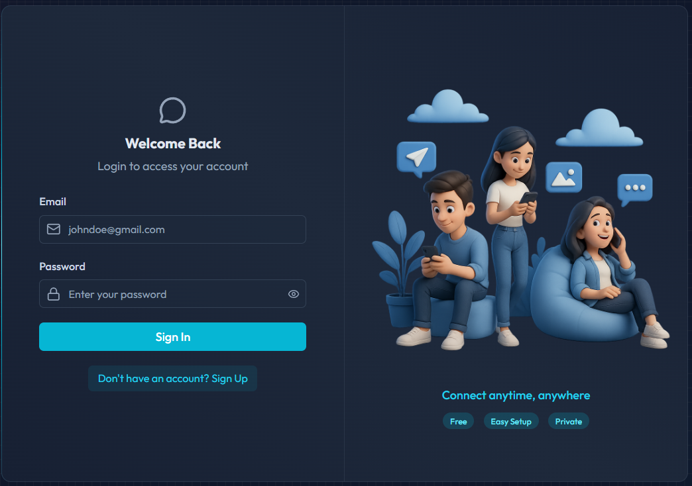

# 💬 Real-Time Chat App (MERN + Socket.io)

A full-stack real-time chat application built using the **MERN stack** with **Socket.io** for instant messaging. This project focuses on scalability, clean architecture, and production-ready features.

### 🔐 Login Page



---

## 🚀 Features

- 🔐 Custom JWT Authentication (no third-party auth)
- ⚡ Real-time Messaging using Socket.io
- 🟢 Online/Offline Presence Indicators
- 🔔 Notification & Typing Sounds (toggle support)
- 📧 Welcome Emails on Signup (Resend integration)
- 🖼️ Image Uploads (Cloudinary)
- 🌐 REST API with Node.js & Express
- 🗄️ MongoDB for Data Persistence
- 🚦 API Rate Limiting (Arcjet)
- 🎨 Beautiful UI with React, Tailwind CSS & DaisyUI
- 🧠 Zustand for State Management
- 🔧 Git & GitHub Workflow (branches, PRs, merges)

---

## 📁 Project Structure

---

## ⚙️ Environment Variables

Create a `.env` file inside the **/backend** folder and add the following:
- PORT=3000
- MONGO_URI=your_mongo_uri_here

- NODE_ENV=development

- JWT_SECRET=your_jwt_secret

- RESEND_API_KEY=your_resend_api_key
- EMAIL_FROM=your_email_from_address
- EMAIL_FROM_NAME=your_email_from_name

- CLIENT_URL=http://localhost:5173

- CLOUDINARY_CLOUD_NAME=your_cloudinary_cloud_name
- CLOUDINARY_API_KEY=your_cloudinary_api_key
- CLOUDINARY_API_SECRET=your_cloudinary_api_secret

- ARCJET_KEY=your_arcjet_key
- ARCJET_ENV=development

---

## 🛠️ Tech Stack

### Frontend
- React (Vite)
- Tailwind CSS
- DaisyUI
- Zustand

### Backend
- Node.js
- Express.js
- MongoDB (Mongoose)

### Integrations
- Socket.io
- Cloudinary
- Resend
- Arcjet
  
---

## 🔧 Run the Backend
```
cd backend
npm install
npm run dev
```


---

## 💻 Run the Frontend
```
cd frontend
npm install
npm run dev
```

---

## 🌐 Deployment

- **Frontend:** Vercel / Netlify  
- **Backend:** Render / Railway / Sevallaa  
- **Database:** MongoDB Atlas
  
---

## 📌 Future Improvements

- Group Chats & Channels  
- Message Reactions  
- Read Receipts  
- Push Notifications  
- File Sharing  
- End-to-End Encryption  

---

## 📜 License

This project is licensed under the MIT License.

---

## 💡 Author

**Nitakshi Azad**

---

## ⭐ Support

If you like this project, give it a ⭐ on GitHub!

